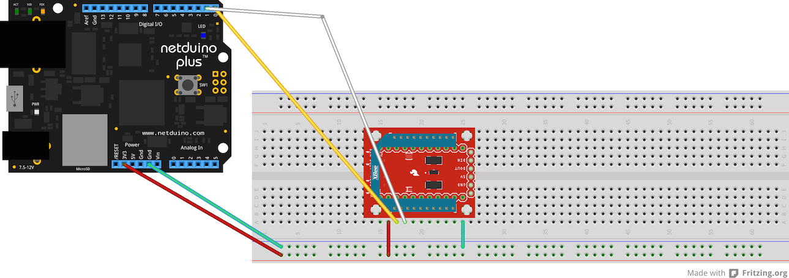

Basic XBee Example
===
Simple program that monitors the serial port for an ON or OFF command and then turns the onboard LED on or off based on the command received from the XBee.  You need to have another program to send the command.  For testing purposes you can simply use a terminal like X-CTU and connect one of the XBees to your computers usb port.

##Wiring Diagram

The example consists of a single circuit that makes use of the Netduino's UART pins.

* The Digital I/O Pins 0 and 1 make up COM1 on the Netduino.
* DOUT on the XBee needs to go to a UART Rx pin on the Netduino (D-I/O Pin 0)
* DIN on the XBee needs to go to a UART Tx pin on the Netduino (D-I/O Pin 1)

The Fritzing design file can be found [HERE](Docs/NetduinoXBee.fzz)